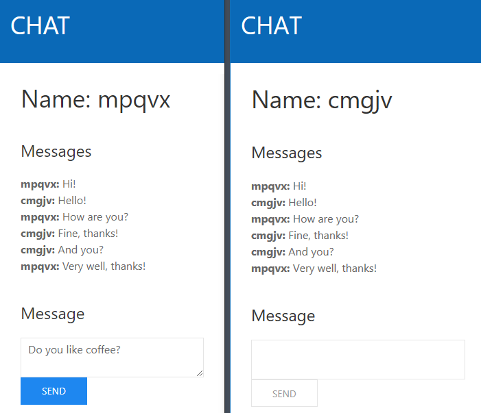

# AspNetCoreSignalR

SignalR in ASP.NET Core.

## Tools, Practices and Technologies

* Cross-Platform (Windows, Linux, macOS)
* Visual Studio 2017
* .NET Core 2.2
* ASP.NET Core 2.2
* C# 7.3
* SPA (Single Page Application)
* Angular 7.2.7
* Typescript 3.2.4
* HTML5
* CSS3
* SASS (Syntactically Awesome Style Sheets)
* UIkit
* Dependency Injection

## Screenshot



## Run Visual Studio 2017

1. Open directory **AspNetCoreSignalR.Client\ClientApp** in command line and execute **npm run restore**.

2. Set **all projects to start** (Multiple startup projects).

5. Press **F5**.

6. Open <https://localhost:8020> **in more than one browser tab**.

## Run Command Line

1. Install [.NET Core SDK](https://aka.ms/dotnet-download).

2. Open directory **AspNetCoreSignalR.Client\ClientApp** in command line and execute **npm run restore**.

3. Open directory **AspNetCoreSignalR.Client** in command line and execute **dotnet run**.

4. Open directory **AspNetCoreSignalR.Server** in command line and execute **dotnet run**.

5. Open <https://localhost:8020> **in more than one browser tab**.

## Server

### ChatModel.cs

 ```csharp
public class ChatModel
{
    public string Message { get; set; }

    public string Name { get; set; }
}
 ```

### ChatHub.cs

 ```csharp
public class ChatHub : Hub
{
    public void SendToAll(ChatModel model)
    {
        Clients.All.SendAsync(nameof(SendToAll), model);
    }
}
 ```

### Startup.cs

 ```csharp
public class Startup
{
    public void Configure(IApplicationBuilder application)
    {
        application.UseCors(x => x.AllowAnyOrigin().AllowCredentials().AllowAnyHeader().AllowAnyMethod());
        application.UseSignalR(x => x.MapHub<ChatHub>(string.Empty));
    }

    public void ConfigureServices(IServiceCollection services)
    {
        services.AddCors();
        services.AddSignalR();
    }
}
 ```

## Client

### ChatService.ts

 ```typescript
export class ChatService {
    public sendToAllEvent = new Subject<ChatModel>();
    private connection: HubConnection;

    constructor() {
        this.connection = new HubConnectionBuilder().withUrl(environment.chatHubUrl).build();
        this.connection.on("SendToAll", (model: ChatModel) => { this.sendToAllEvent.next(model); });
        this.startConnection();
    }

    public sendToAll(model: ChatModel) {
        return this.connection.invoke("SendToAll", model);
    }

    private startConnection() {
        this.connection.start().catch(() => { setTimeout(() => { this.startConnection(); }, 5000); });
    }
}
```

### ChatComponent.ts

 ```typescript
export class ChatComponent {
    public model = new ChatModel();
    @ViewChild("messages") public messages: ElementRef;

    constructor(private readonly chatService: ChatService) {
        this.chatService.sendToAllEvent.subscribe((model: ChatModel) => {
            this.messages.nativeElement.innerHTML += `<b>${model.name}: </b> ${model.message} <br />`;
        });
    }

    public submit() {
        this.chatService.sendToAll(this.model).then(() => { this.model.message = ""; });
    }
}
```
